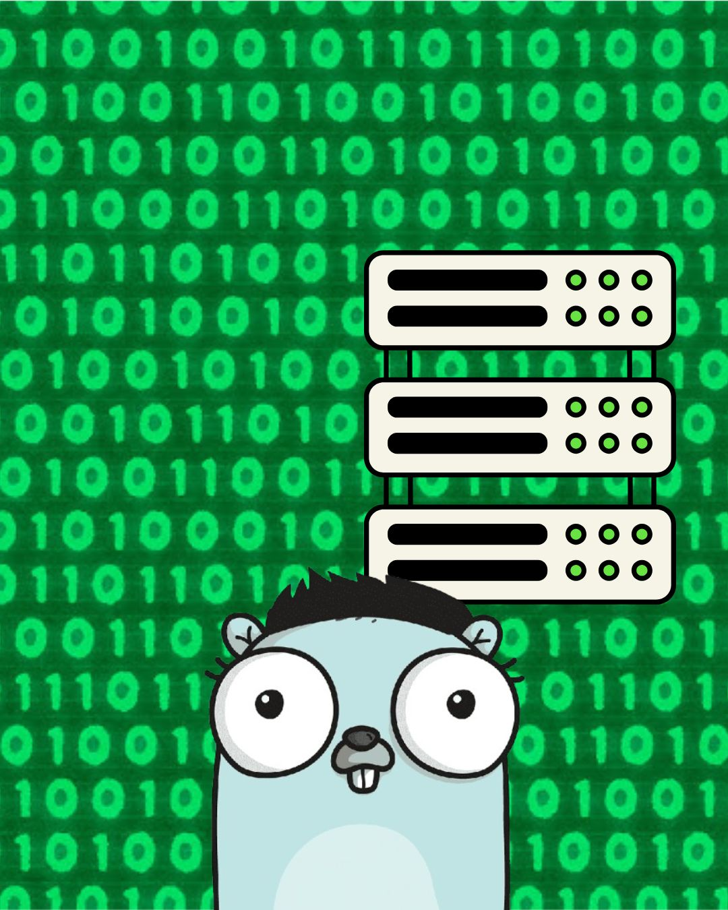

# Socket_GOLANG
Servidor con GO y se pone a la escucha de conexiones en mi caso lo hice con código python
El servidor esta a la escucha por el puerto 8080 utilizando el servicio TCP en caso de querer  cambiar el puerto de escucha se tiene que hacer desde el código fuente.
En el archivo cliente.py se encuentra la constante SERVER la cual tiene la ip del servidor local. En caso de que se quiera hacer conexión desde una máquina remota se tendrá que cambiar el valor de esta constante por el de la ip del servidor.

